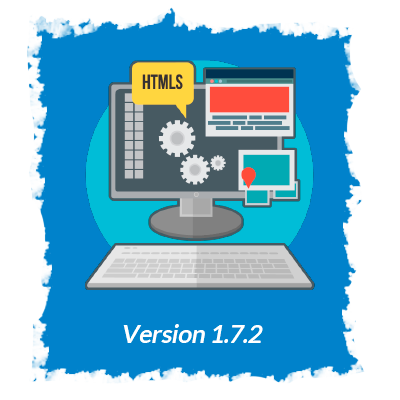

The version in the top of this file is the last version.

- First number: It show a big change in the project
- Middle number: Show the features/changes added
- Last Number: Show the error that was fixed

 
 

</img>

<b>★ Login ★</b>

- <b>Component for show valid data for login</b>: This component show the correct email and password for access to app

<b>★ Home ★</b>

- <b>Scores</b>: Secction that show all scores (price,healtscore etc) built and show all value expected.
- <b>Update of scores when is deleted an item</b>: When an item is deleted from menu the score will update.
  <b>★ Dishs ★</b>

- <b>Price,Ready in and healtScore</b>: Each dish will show the characteristics (price, Ready in [min] and health score).
- <b>Loading Msg</b>: A loading msg will appers meanwhile the cards is loaded. This loading msg doesnt allow user make any acction
- <b>Not more request Msg</b>: When the all free requests from Spoonacular Api will be used the app will show a msg telling this.

</img>

<b>★ Auth ★</b>

- <b>Not found page</b>: now it will show a msg when the user go to a nonexistent page, this msg, will have a button for go to Home (if the user is loggin, if not go to login)
- <b>Possible come back to login</b>: Now when the user will be autentificate, she wont come back to login.

</img>

★ Login ★

- When you press one of field and dont fill it, for then press the button of "Enviar" it will show up the msg: `El Email y/o contraseñana no son correctos`.

★ Home ★

- Search bar is not build
- Score of healthScore and readyIn show a total value instead of average.

---

 
 

</img>

★ Login ★

- Access at site by a login (email and password)
- Error Msg:
  - If both field are empty will show a msg of error/warnning
  - If the email/password are incorrect at the moment of press the button
  - If is not possible access to api for login
- Loading msg: A msg of processing informacion (which doent allow user press any button) appers after press `enviar`

★ Auth ★

- It is not possible access to home without are loggin in.
- If the loggin is successfull it will rendirec to login

★ Home ★

- 4 dish are shown, with his title
- It is possible delete a dish of menu pressing the button `Eliminar`

</img>

★ Login ★

- When you press one of field and dont fill it, for then press the button of "Enviar" it will show up the msg: `El Email y/o contraseñana no son correctos`.

★ Auth ★

- After be authenticated if possible come back to login.
- After be authenticated if possible go at nonexistent rutes/directions.

★ Home ★

- Search bar is not build
- Secction that show all scores (price,healtscore etc) is not build.

★ Dishs ★

- The cards doesnt show the characteristics of dishs.
